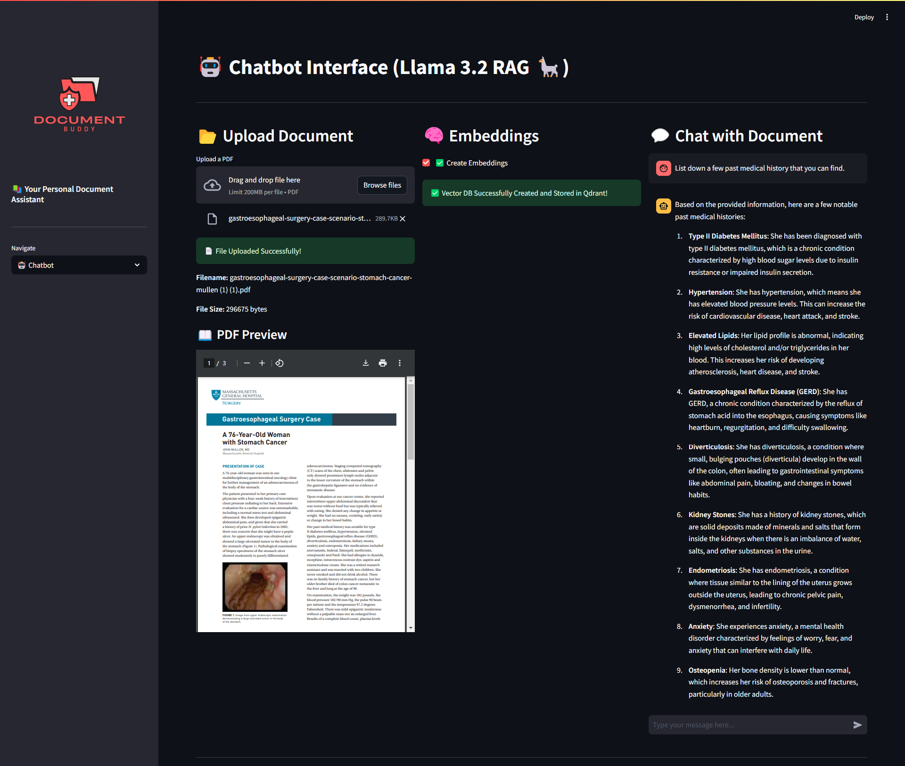

# RAG with Llama and Streamlit🤖
RAG Based LLM AI Chatbot Built using Open Source Stack (Llama 3.2 Model, BGE Embeddings, and Qdrant running locally within a Docker Container)


This project demonstrates a **Retrieval-Augmented Generation (RAG)** system powered by the **Llama** language model and deployed using **Streamlit**. The application allows users to input queries, retrieves relevant information from a knowledge base, and generates responses using Llama.

---



## Table of Contents

1. [Overview](#overview)
2. [Features](#features)
3. [Installation](#installation)
4. [Usage](#usage)
5. [Project Structure](#project-structure)
6. [Advanced Configuration](#advanced-configuration)
7. [Contributing](#contributing)
8. [License](#license)
9. [Acknowledgments](#acknowledgments)
10. [Contact](#contact)

---

## Overview

The RAG system combines the strengths of retrieval-based and generative models. It retrieves relevant documents or snippets from a knowledge base and uses the Llama language model to generate contextually accurate responses. This approach ensures both factual correctness and natural language fluency.

Streamlit is used to create an interactive web interface, making it easy for users to interact with the RAG system.

---

## 🛠️ Features

- **📂 Upload Documents**: Easily upload and preview your PDF documents within the app.
- **🧠 Create Embeddings**: Generate embeddings for your documents to enable efficient search and retrieval.
- **🤖 Chatbot Interface**: Interact with your documents using a smart chatbot that leverages the created embeddings.
- **📧 Contact**: Get in touch with the developer or contribute to the project on GitHub.
- **🌟 User-Friendly Interface**: Enjoy a sleek and intuitive UI with emojis and responsive design for enhanced user experience.

---

## 🖥️ Tech Stack

The Document Buddy App leverages a combination of cutting-edge technologies to deliver a seamless and efficient user experience. Here's a breakdown of the technologies and tools used:

- **[LangChain](https://langchain.readthedocs.io/)**: Utilized as the orchestration framework to manage the flow between different components, including embeddings creation, vector storage, and chatbot interactions.
  
- **[Unstructured](https://github.com/Unstructured-IO/unstructured)**: Employed for robust PDF processing, enabling the extraction and preprocessing of text from uploaded PDF documents.
  
- **[BGE Embeddings from HuggingFace](https://huggingface.co/BAAI/bge-small-en)**: Used to generate high-quality embeddings for the processed documents, facilitating effective semantic search and retrieval.
  
- **[Qdrant](https://qdrant.tech/)**: A vector database running locally via Docker, responsible for storing and managing the generated embeddings for fast and scalable retrieval.
  
- **[LLaMA 3.2 via Ollama](https://ollama.com/)**: Integrated as the local language model to power the chatbot, providing intelligent and context-aware responses based on the document embeddings.
  
- **[Streamlit](https://streamlit.io/)**: The core framework for building the interactive web application, offering an intuitive interface for users to upload documents, create embeddings, and interact with the chatbot.


## Installation

### Prerequisites

- Python 3.8 or higher
- Pip (Python package manager)

### Steps

1. Clone the repository:
   ```bash
   git clone https://github.com/aakash123254/Llama_RAG.git
   cd LLAMA
   ```

2. Create a virtual environment and install dependencies:
    ```bash
    python -m venv venv
    venv\Scripts\activate     # On Windows
    # source venv/bin/activate   # On Linux or MacOS
    pip install -r requirements.txt
    ```
3. Create required directories:
    ```bash
    mkdir models data
    ```
4. Download the Llama model weights and place them inside the models/ directory.

5. Run the application:
    ```bash 
    streamlit run app.py
    ```

# Usage
Open your browser and navigate to the URL displayed in the terminal (usually http://localhost:8501)

Enter your query in the input box and click Submit

The system will retrieve relevant information from the knowledge base and generate a response using Llama

View the results and continue interacting as needed

# Project Structure
```
    Llama_RAG/
├── app.py                
├── requirements.txt
├── chatbot.py            
├── vectors.py            
├── logo.png
└── README.md 

```

# Contributing
We welcome contributions to improve this project! To contribute:

1. Fork the repository

2. Create a new branch:
```bash
    git checkout -b feature/YourFeatureName
```
3. Commit your changes:
```bash
    git commit -m "Add some feature"
```
4. Push to the branch:
```bash
    git push origin feature/YourFeatureName
```
5. Open a pull request
Please ensure your code follows the project's coding standards and includes appropriate documentation.

### 🔗 Useful Links

•	Streamlit Documentation: https://docs.streamlit.io/

•	LangChain Documentation: https://langchain.readthedocs.io/

•	Qdrant Documentation: https://qdrant.tech/documentation/

•	ChatOllama Documentation: https://github.com/langchain-ai/langchain-llms#ollama

## License
This project is licensed under the MIT License. See the LICENSE file for details.

# Acknowledgments
🦙 Llama Team – For providing the powerful language model

🌟 Streamlit – For enabling rapid development of interactive web applications

🤝 Open-Source Community – For inspiration, tools, and continued support

For any questions or feedback, feel free to open an issue or contact the project maintainer.
Developer - Aakash Harwani
email: aakashharwani06@gmail.com

Happy coding! 🚀